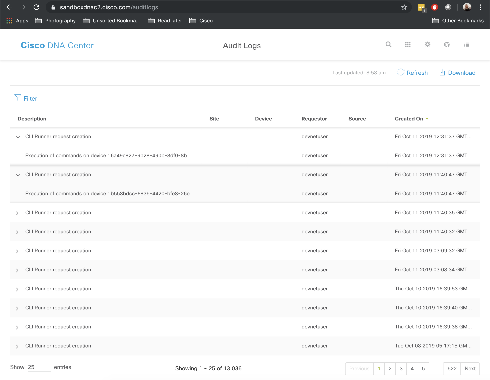
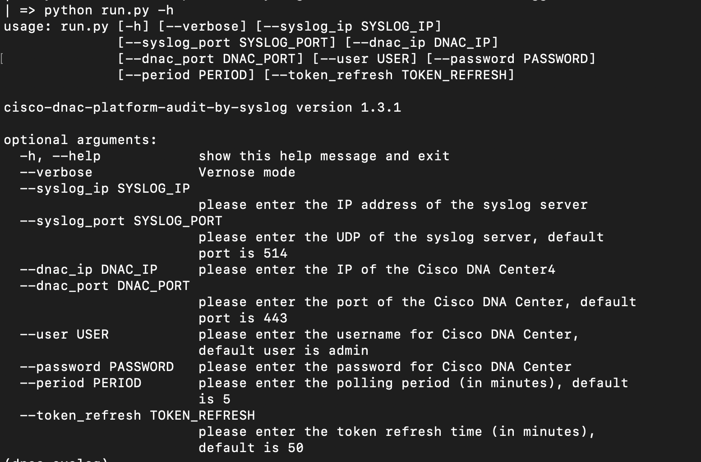
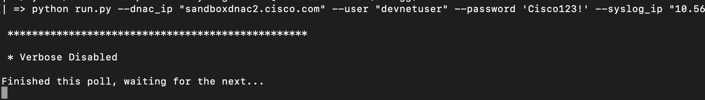
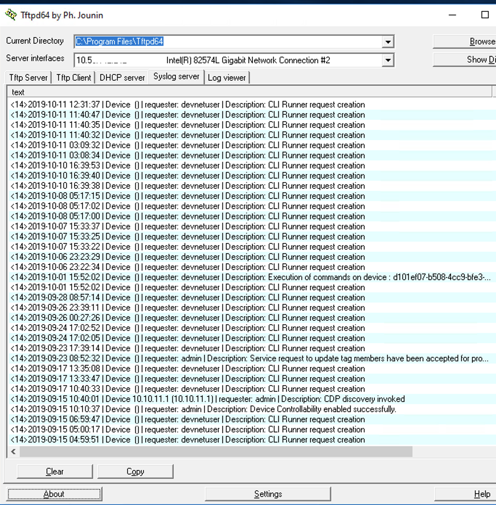

# Cisco DNA Center platform: Audit log export via Syslog
[](https://developer.cisco.com/codeexchange/github/repo/obrigg/cisco-dnac-platform-syslog-audit)

This code will query Cisco DNA Center for its audit log every [defined period of time], in order to convert the events to an external program/platform using Syslog.
* Technology stack: Python + Docker (optional)
* Status:  Alpha, designed to prove the ability and openess of Cisco DNA Center.
* Screenshot:


    Cisco DNA Center's audit log screen:
<p align="center">

</p>
    Help screen:
<p align="center">

</p>
    Example run (using [DevNet's alway-on DNA Center sandbox](https://developer.cisco.com/site/sandbox/)):
<p align="center">

</p>
    Example result (on a Windows machine running a freeware syslog server):
<p align="center">

</p>

## Use Case Description

Even though Cisco DNA Center is a cutting edge solution, some of our customers are using existing monitoring and SIEM systems that use legacy protocols. In this case - syslog.
As Cisco DNA Center is not designed to export its audit log via syslog - this code bridges that gap, allowing the customer to leverage existing syslog-based solution.

## Disclaimer
This solution is NOT using DNACaaP APIs, but private APIs. They might stop working in future releases.

## How to setup
```
docker run -d obrigg/cisco-dnac-platform-syslog-audit --dnac_ip 'DNAC-IP' --syslog_ip 'SYSLOG-SERVER-IP' --password 'password'
```
### Cisco DNA-C
#### Prerequisites
* Enable Cisco DNA-C as a Platform
  * How-To Guide https://www.cisco.com/c/en/us/td/docs/cloud-systems-management/network-automation-and-management/dna-center-platform/1-2-5/user_guide/b_dnac_platform_ug_1_2_5/b_dnac_platform_ug_1_2_5_chapter_01.html
* Enable "DNA Center REST API" Bundle

## Troubleshooting
Additional arguments that may help:
* --verbose: for elaborated outputs.
* --dnac_port: if the HTTPS port is different than the default 443.
* --syslog_port: if the syslog port is different than the default 514.
* --period: if you'd like to pulling to be different than 5 minutes.
* --token_refresh: if you'd like the token refresh time to be different than 50 minutes.

## Licensing info
Copyright (c) 2019 Cisco and/or its affiliates.

This software is licensed to you under the terms of the Cisco Sample
Code License, Version 1.1 (the "License"). You may obtain a copy of the
License at

               https://developer.cisco.com/docs/licenses

All use of the material herein must be in accordance with the terms of
the License. All rights not expressly granted by the License are
reserved. Unless required by applicable law or agreed to separately in
writing, software distributed under the License is distributed on an "AS
IS" BASIS, WITHOUT WARRANTIES OR CONDITIONS OF ANY KIND, either express
or implied.
